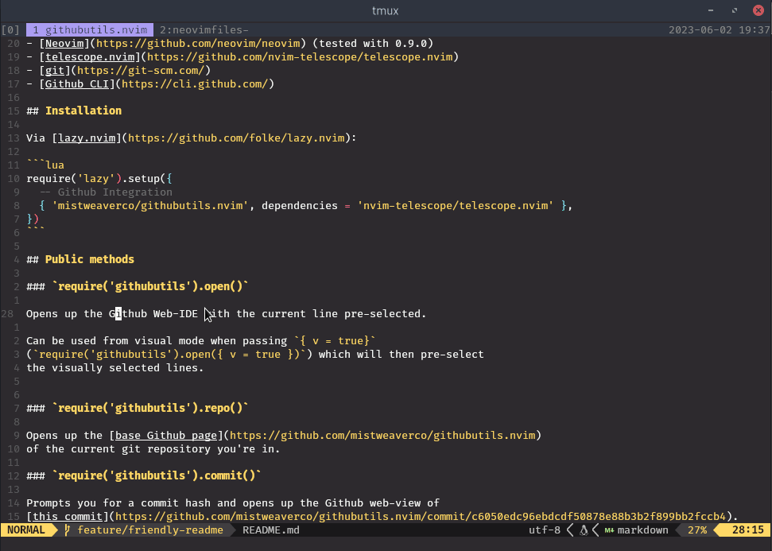
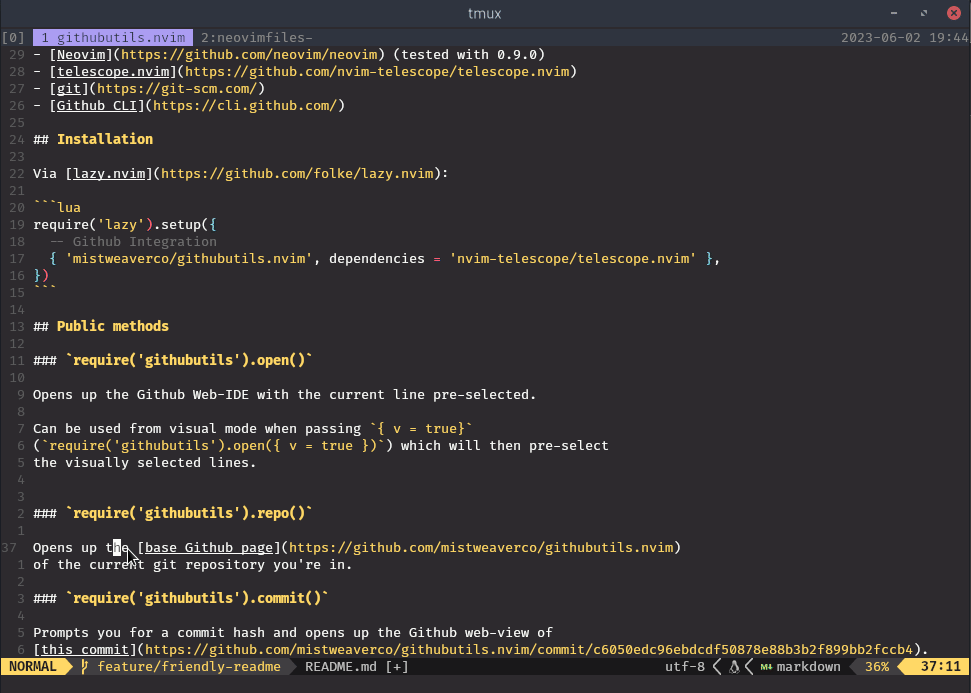
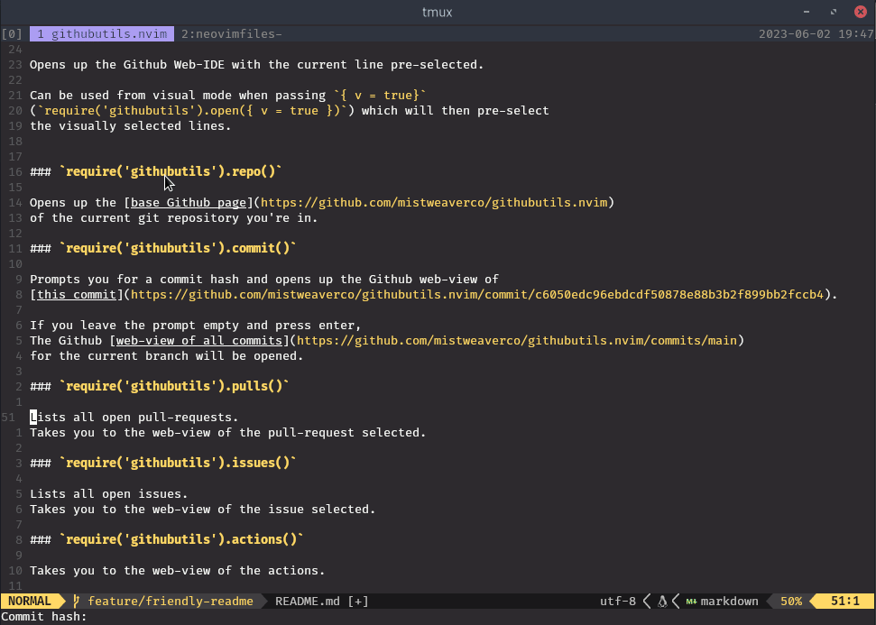
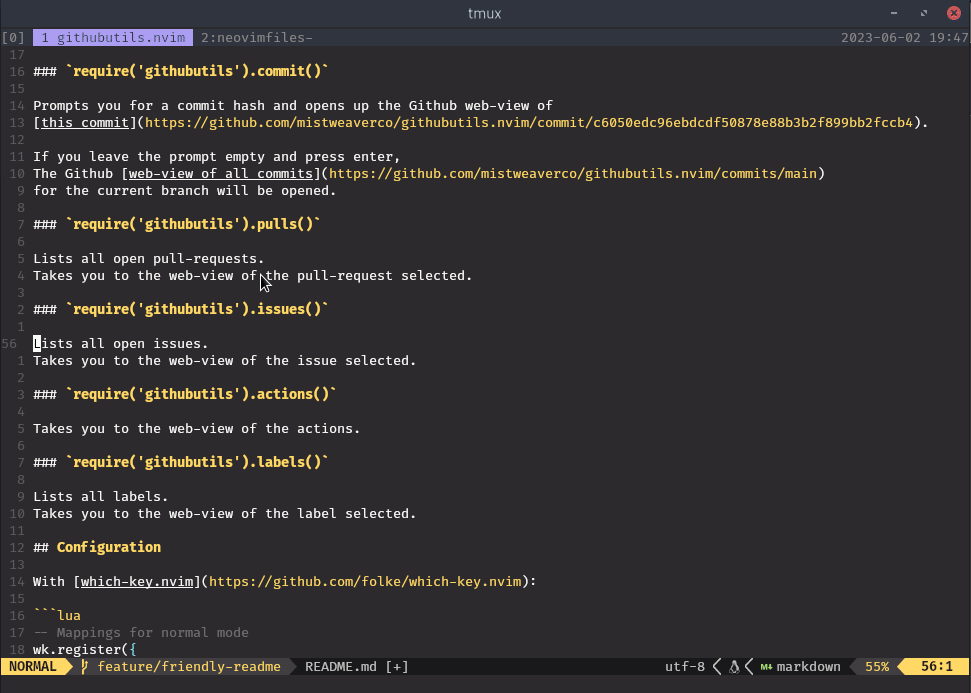
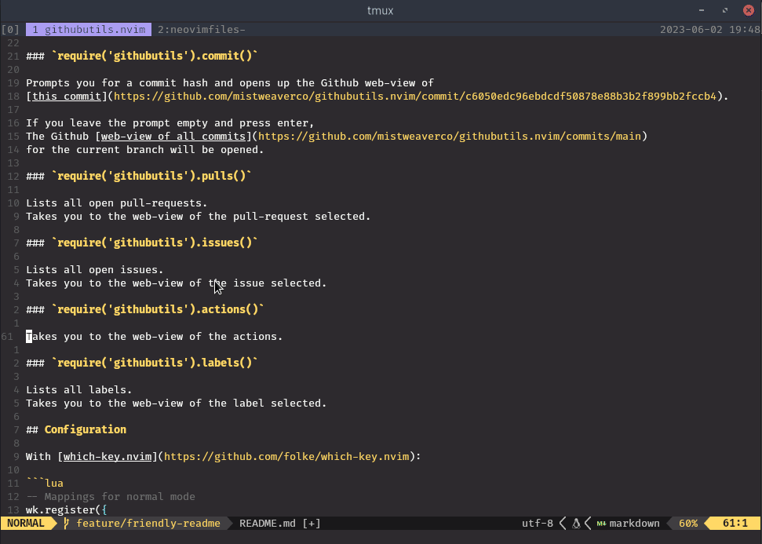
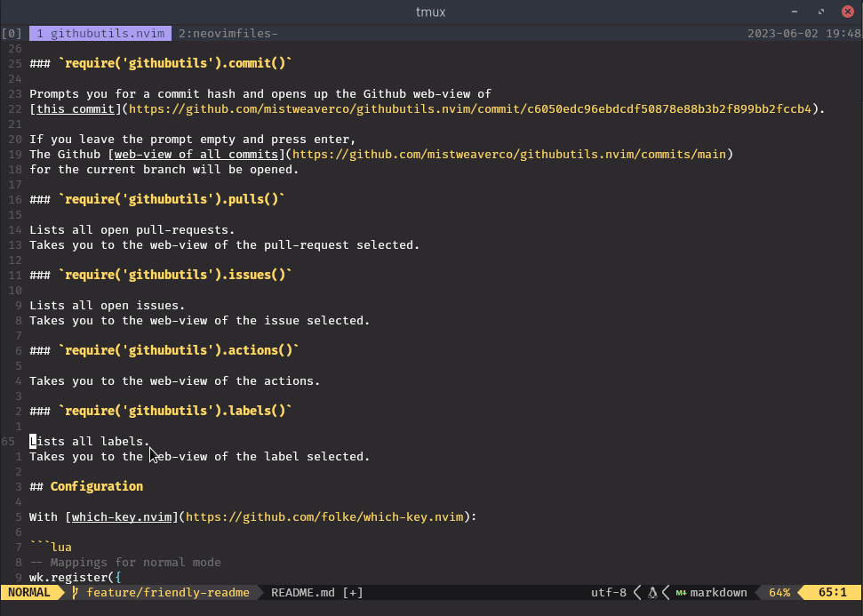

<div align="center">


# ndoo.nvim


[](https://github.com/mistweaverco/ndoo.nvim/releases/latest)

[Requirements](https://ndoo.mwco.app/#/requirements) • [Install](#install) • [Usage](https://ndoo.mwco.app/#/usage)

<p></p>

A minimal Git-Multi-Platform Interface for Neovim.

Ndoo is swahili for "bucket".

It has nothing to do with bitbucket,
but it's a cool name for a collection of a Git-Multi-Platform Interface.

It gives you quick access to your Github and Bitbucket repositories from within Neovim.

<p></p>

</div>

## Requirements

- [Neovim](https://github.com/neovim/neovim) (tested with 0.9.0)
- [telescope.nvim](https://github.com/nvim-telescope/telescope.nvim)
- [git](https://git-scm.com/)

- For Github Integration:
  - [Github CLI](https://cli.github.com/)

- For Bitbucket Integration:
  - [cURL](https://curl.se/)

## Install

Via [lazy.nvim](https://github.com/folke/lazy.nvim):

```lua
require('lazy').setup({
  -- Github Integration
  {
    'mistweaverco/ndoo.nvim',
    dependencies = {
      'nvim-telescope/telescope.nvim'
    }
  },
})
```

## Public methods

### `require('ndoo').open()`

Opens up the Github Web-IDE with the current line pre-selected (on the current branch).



Can be used from visual mode when passing `{ v = true }`
(`require('ndoo').open({ v = true })`) which will then pre-select
the visually selected lines (on the current branch).


**NOTE:** additionally `commit = true` can be passed which will open the current commit,
rather than the current branch.

### `require('ndoo').repo()`

Opens up the [base Github page](https://github.com/mistweaverco/githubutils.nvim)
of the current git repository you're in.



### `require('ndoo').commit()`

Prompts you for a commit hash and opens up the Github web-view of
[this commit](https://github.com/mistweaverco/githubutils.nvim/commit/c6050edc96ebdcdf50878e88b3b2f899bb2fccb4).


If you leave the prompt empty and press enter,
the Github [web-view of all commits](https://github.com/mistweaverco/githubutils.nvim/commits/main)
for the current branch will be opened.


### `require('ndoo').pulls()`

Lists all open pull-requests.
Takes you to the web-view of the pull-request selected.



### `require('ndoo').issues()`

Lists all open issues.
Takes you to the web-view of the issue selected.



### `require('ndoo').actions()`

Takes you to the web-view of the actions.



### `require('ndoo').labels()`

Lists all labels.
Takes you to the web-view of the label selected.



## Configuration

With [which-key.nvim](https://github.com/folke/which-key.nvim):

```lua
-- Mappings for normal mode
wk.register({
  g = {
    name = "Goto",
      h = {
        name = "Git Utils",
        o = { "<Cmd>lua require('ndoo').open()<CR>", "Open" },
        O = { "<Cmd>lua require('ndoo').open({ commit = true })<CR>", "Open commit" },
        r = { "<Cmd>lua require('ndoo').repo()<CR>", "Repo" },
        c = { "<Cmd>lua require('ndoo').commit()<CR>", "Commit" },
        p = { "<Cmd>lua require('ndoo').pulls()<CR>", "Pulls" },
        i = { "<Cmd>lua require('ndoo').issues()<CR>", "Issues" },
        a = { "<Cmd>lua require('ndoo').pipelines()<CR>", "Pipelines" },
        l = { "<Cmd>lua require('ndoo').labels()<CR>", "Labels" },
      },
  },
}, { prefix = "<leader>" })

-- Mappings for visual mode
wk.register({
  g = {
    name = "Goto",
      h = {
        name = "Git Utils",
        o = { "<Cmd>lua require('ndoo').open({ v = true })<CR>", "Open" },
        O = { "<Cmd>lua require('ndoo').open({ v = true, commit = true })<CR>", "Open commit" },
      },
  },
}, { prefix = "<leader>", mode = "v" })
```

